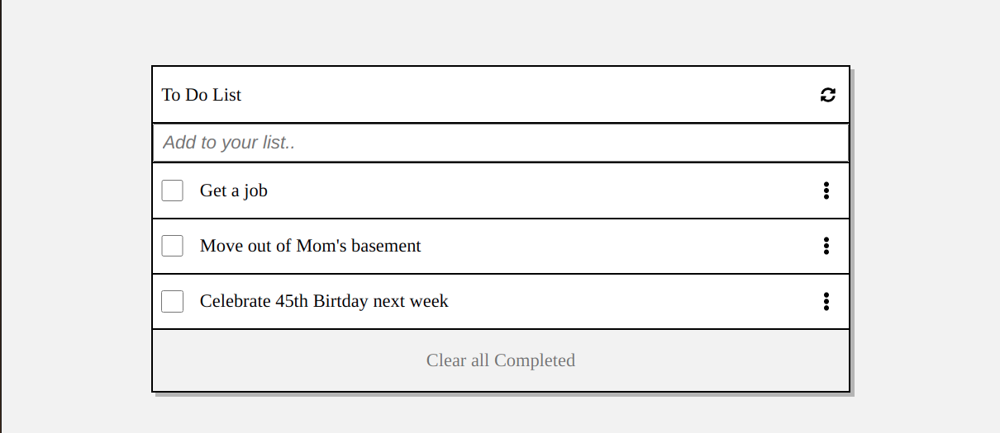

# To-Do List 

> This is an interactive tool to update and remind yourself of what you need to do.

## Built With

- JavaScript
- Webpack
- HTML & CSS

## Live Demo

[Live Demo Link](https://compassionate-stonebraker-45d168.netlify.app/)

To get a local copy up and running follow these simple example steps.

### Setup

Go to [My Repo](https://github.com/sneeu-leeu/To-Do-List/tree/development) and clone the project by opening your terminal and entering "git clone" + "The link supplied".

cd into the repo

run ' npm install '

Open the repo in your code editor and launch it by running '$ npm start' !

## Authors

👤 **Stephan**

Github: @sneeu-leeu

Twitter: @Stephan07484055

Linkedin: Stephan Annandale

## 🤝 Contributing

Contributions, issues, and feature requests are welcome!

Feel free to check the [issues page](https://github.com/sneeu-leeu/To-Do-List/issues/4).

## Show your support

Give a ⭐️ if you like this project!

This project is [MIT](https://opensource.org/licenses/MIT) licensed.

